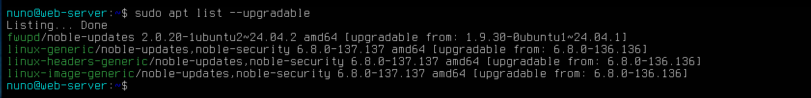
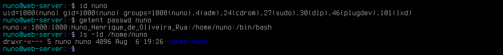
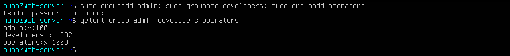
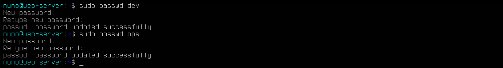
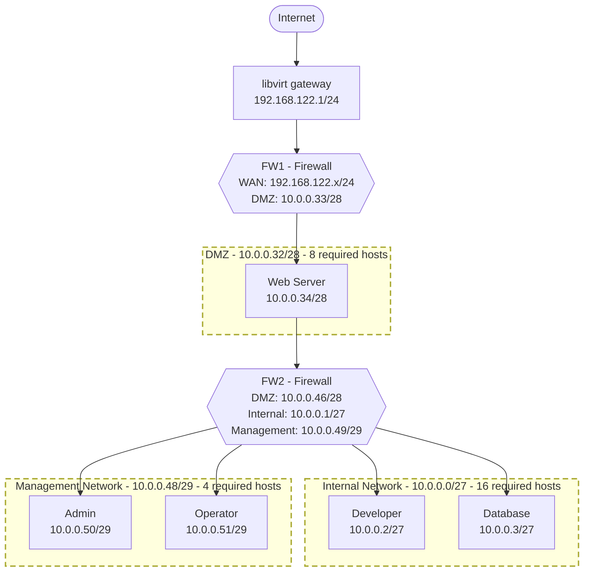

# Web Server


This project involves the deployment and administration of a production-ready Linux web server, provisioned in a virtualized environment and designed for cloud deployment. The server represents part of the infrastructure for a web application.

My role is Systems and Network Administrator. My responsibility consists of provisioning a secure server so that the development team can develop the web application without having to manage the infrastructure.

The work covers everything from operating system installation to monitoring and validating the system in production. The implementation tasks include:

- Operating system installation.
- Management of access, privileges, and system resources.
- System hardening and TLS implementation.
- Setup of monitoring and event logging systems.

Finally, the server is also tested against various failure scenarios, which are diagnosed and resolved using standard systems and network administration procedures.

---


## Table of Contents

1. [Methodology & Source Selection](#1-methodology--source-selection)
2. [Requirements of Web Server](#2-requirements-of-web-server)
3. [Architecture & Design](#3-architecture--design)
4. [Phases of implementation](#5-phases-of-implementation)
5. [Quick Start](#6-quick-start)
6. [Operations, Monitoring, Troubleshooting & Controlled Failure Scenarios](#6-operation-monitoring-troubleshooting--controlled-failure-scenarios)
7. [Automation and Cloud Deployment](#7-automation-and-cloud-deployment)
8. [Official References](#9-official-references)

---


## 1. Methodology & Source Selection

The methodology used in this project is as follows:

1. Relevant technical and security references are selected to identify the requirements for the server.
2. The requirements are extracted, summarised, and linked to their original sources.
3. Based on these requirements, the web server architecture and security controls are designed.
4. The server is implemented using official product documentation and a documented task plan.
5. The implementation is validated through functional, security, and failure-recovery tests. The results are recorded as evidence.
6. Finally, the server is deployed in a cloud IaaS environment and compared with the local implementation to verify its reproducibility.

This approach provides a base for defining the requierements necesary for an Web Server from the selected rsources. It also, provides clear criteria for justify the design decisions. The technologies used are selected to satisfy the defined requirements.

---


## 2. Requirements of Web Server

As a result of the research described in the previous section, a set of system and network requirements was extracted from the selected security references. The complete requirement selected, including and their are available here:

- [System Requirements](docs/sys-requirements.md)
- [Network Requirements](docs/net-requirements.md)

The table below presents the main requirements selected for the design, implementation, and validation of the server. These requirements were selected because they define important security and operational controls and can be verified through reproducible tests. 

| ID  | Reference   | Requirement                                                                                             | Verification                                                                                                                                                                              |
| --- | ----------- | ------------------------------------------------------------------------------------------------------- | ----------------------------------------------------------------------------------------------------------------------------------------------------------------------------------------- |
| R01 | APP.3.2.A1  | The web server process must be assigned to a user account with minimum rights.                          | Inspect NGINX processes with `ps -eo user,group,pid,cmd` and verify that worker processes run under the configured service account. Save the command output.                              |
| R02 | APP.3.2.A2  | Web server files must be protected against unauthorised reading or modification.                        | Inspect ownership and permissions with `stat` and `namei -l`. Attempt to modify a protected file using an unauthorised account and record the `Permission denied` result.                 |
| R03 | SYS.1.5.A12 | A role and permissions model for administration should be implemented.                                  | Document the administrative roles and compare them with `getent group`, `id` and `sudo -l -U <user>`. Save the role matrix and command outputs.                                           |
| R04 | SYS.1.5.A8  | The tasks of administrator groups should be defined and clearly separated.                              | Document the responsibilities assigned to each administrative group and verify group membership with `getent group` and `id`.                                                             |
| R05 | SYS.1.3.A6  | The files `/etc/passwd`, `/etc/shadow`, `/etc/group`, and `/etc/sudoers` should not be edited directly. | Review the provisioning playbooks and verify that accounts and permissions are managed with dedicated modules or commands. Validate the files with `pwck -r`, `grpck -r` and `visudo -c`. |
| R06 | NET.1.1.A2  | Complete network documentation, including a network diagram, must be produced and maintained. | Compare the network diagram and addressing plan with the actual output of `ip -br addr`, `ip route` and `ss -lntup`. Store the diagram and outputs.                                  |
| R07 | SYS.1.5.A11 | The virtual infrastructure should be administered through a separate management network.      | Verify the management interface or subnet using `ip -br addr` and `ip route`. Confirm with firewall tests that administrative access is accepted only from the management network.   |
| R08 | SYS.1.5.A9  | The required network segments should be planned.                                              | Document each segment, subnet, purpose and permitted communication flow. Compare the plan with the deployed interfaces, routes and firewall rules.                                   |
| R09 | SYS.1.5.A4  | Virtual networks must not allow firewalls or monitoring systems to be bypassed                | Attempt direct communication between restricted network segments. Record the failed connection, firewall logs and an `nmap` scan showing that the protected path cannot be bypassed. |
| R10 | APP.3.2.A11                | The web server must provide secure TLS encryption for connections passing through untrusted networks.                                                  | Verify the certificate and TLS negotiation with `openssl s_client`, inspect supported protocols with `nmap --script ssl-enum-ciphers`, test the service with `curl` and capture traffic with Wireshark to confirm that HTTP content is encrypted. |
| R11 | SYS.1.3.A8                 | Only SSH should be used to establish encrypted and authenticated interactive connections.                                                              | Perform a successful SSH connection using public-key authentication. Use `nmap` to confirm that insecure remote-access services are not exposed and capture the SSH session with Wireshark to confirm encrypted traffic.                          |
| R12 | NET.3.2.A2                 | Firewall rules must clearly define the permitted communication links and data flows. All other connections must be blocked using a whitelist approach. | Record `ufw status numbered` and the cloud firewall rules. Run an external `nmap -Pn -p-` scan and verify that only explicitly authorised ports are reachable.                                                                                    |
| R13 | CCN-STIC-812, sections 4.5 | Protection against denial-of-service attacks and resource exhaustion.                                                                                  | Perform a controlled load test against the local test environment. Record configured connection or request limits, returned status codes and CPU, memory and connection metrics during the test.                                                  |
| R14 | CCN-STIC-812, section 4.5  | Mandatory use of HTTPS throughout the website.                                                                                                         | Run `curl -I http://<domain>` and verify an HTTP redirect to HTTPS. Run `curl -I https://<domain>` and verify a successful response through TLS.                                                                                                  |
| R15 | SYS.1.5.A26                | A PKI should be used for certificate-protected communications.                                                                                         | Inspect the certificate chain, issuer, subject, validity dates and fingerprint with `openssl s_client` and `openssl x509`. Record the certificate-renewal test.                                                                                   |
| R16 | APP.3.2.A4                              | The web server must log general errors.                                                                                                             | Generate a controlled NGINX failure, such as an inaccessible file or unavailable upstream. Record the request, the resulting error and the related entries from `/var/log/nginx/error.log` and `journalctl -u nginx`.                      |
| R17 | APP.3.2.A18                             | The web server should be monitored continuously.                                                                                                    | Stop NGINX or exceed a defined resource threshold. Record the monitoring event, timestamp, affected metric and generated alert.                                                                                                            |
| R18 | NET.1.2.A25                             | Network performance and availability should be monitored continuously.                                                                              | Monitor latency, packet loss and service availability. Generate a controlled connectivity interruption and retain the metric history and alert showing its detection.                                                                      |
| R19 | NET.3.2.A32                             | Firewall diagnosis and troubleshooting should be planned in advance. Actions for typical failure scenarios should be defined and regularly updated. | Execute a documented scenario in which an incorrect firewall rule blocks an authorised service. Save the failed test, firewall logs, diagnosis, corrective action and successful final test.                                               |
| R20 | SYS.1.5.A17                             | Configuration files should be regularly checked for unauthorised modifications                                                                      | Create a configuration-integrity baseline using checksums or an integrity-monitoring tool. Modify a controlled test file and retain the report that detects the change.                                                                    |
| R21 | APP.3.2.A18                             | The web server should be monitored continuously.                                                                                                    | Use an external availability check to detect a controlled service outage. Record the failed probe, alert and successful recovery check.                                                                                                    |
| R22 | CCN-STIC-812, section 5. and NET.1.2.A6 | Protection of backups. Network management data and configurations must be included in backups.                                                      | Back up web content, critical server configuration and network configuration. Delete or modify a controlled test file, restore it and compare its checksum with the original. Save the backup log, restoration output and matching hashes. |

---


## 3. Architecture & Design

Internet → UFW → Ubuntu → NGINX → Web page


This section records the principal decisions and their technical justification.

| Decision                | Selected option         | Source                             |  Reason        |
| ----------------------- | ----------------------- | ---------------------------------- | -------------- |
| Operating system        | Ubuntu Server 24.04 LTS | Ubuntu documentation               |  |
| Web server              | NGINX                   | NGINX documentation                |  |
| Deployment model        | Single virtual machine  | Project constraint                 |  |
| Network filtering       | Cloud firewall and UFW  | Cloud and Ubuntu documentation     |  |
| Administrative access   | OpenSSH                 | OpenSSH and Ubuntu documentation   |  |
| User and group model    | Admin, developers       | Ubuntu documentation               |  |
| Web directory structure |            | FHS and Ubuntu/NGINX documentation |  |
| TLS management          |           | TLS provider documentation         |  |

---


## 4. Implementation Phases

### Operating System Installation

The web server was deployed on a Linux virtual machine with the following specifications:

- Operating System: Ubuntu Server 24.04 LTS
- Virtual processors: 2 vCPU
- RAM: 4 GiB
- Storage: 25 GiB virtual disk
- Firmware: BIOS

The virtual machine runs on a KVM hypervisor and is managed through virt-manager, a graphical interface for libvirt. This platform was selected because of its integration with the Ubuntu 24.04 LTS host system. The installed operating system, kernel, architecture and virtualization environment were verified using `hostnamectl`.


The Static hostname mean that the identity of server y persistent. 

During installation, the 25 GiB virtual disk /dev/vda was manually partitioned using GPT. A 1 MiB BIOS boot partition was created for GRUB, followed by a separate 1 GiB ext4 partition mounted at /boot.

The remaining disk space was assigned to an LVM physical volume. LVM was used to create logical volumes for the root filesystem /, the variable-data directory /var and swap. Separating /var limits the impact that uncontrolled growth of logs and other variable data could have on the root filesystem. Approximately 4 GiB were left free in the volume group for future expansion. 


### Base System Configuration

The objective of this phase was to prepare controlled Linux base before installing network and web services. The configuration focused on package maintenance, system identity, time settings, user roles, privileges and filesystem permissions. These controls are important because services such as SSH and NGINX depend on a correctly configured operating system and a clear access model.


**1. Package maintenance**
APT uses the package information from the configured repositories to install and update software. Updating this information before installing the services helps to avoid versioning issues during the installation of the services. The utility used is:

```bash
sudo apt-get update && sudo apt-get upgrade
```

The folloing command is used to check for the new updates; in this case, 4 updates are pending.



Fix these conflicts by running `sudo apt-get dist-upgrade` Checking again:


**2. System identity, timezone and locale configuration**

The server was configured with a clear system identity and the correct time settings. The hostname selected for the server is:

```bash

```

Correct time configuration is important for system administration because logs, SSH connections, security events and troubleshooting depend on accurate timestamps. A clear hostname is also important because it allows administrators to identify the system correctly in logs and remote sessions.

The command used to list the complete horarie zone and for change the correct region are:

```bash
timedatectl list-timezones
```
The command used to set up the region is:

```bash
timedatectl set-timezone Europe/Madrid
```
The final configuration was checked with


**3. Account defaults and role design.**

The server uses separate accounts and groups for different responsibilities.

| User | Gropup | Responsibility |
| ---- | ------ | -------------- |
| nuno | admin  | System administration |
| dev | developers | Application development |
| ops | operators | Monitoring |

The purpose of this design is to separate responsibilities instead of giving the same permissions to every user.

Linux controls access to files and system resources through users, groups, ownership and read, write and execute permissions. This provides the base for applying the principle of least privilege.

The administrator account was checked before creating the additional roles.

Checking the identity and privilege of current user:



Creating the groups and checking. The GID identify the number asigned automatly



Now modify the admin acounto to add the administrator to admin group and add the users to theis respective group:


The parámeters used are:

- -a: 
- -G: add the group
- -m: create automatly the personal directory of user and copy the file from /etc/skel.
- -U: create a privete group with the same name of user.
- -s: asign a user to a asign directoy 

The final parameter instructs the system that this user should be logged in directly to Bash upon logging in. This configuration is stored in the /etc/passwd directory. This is used for service accounts that should not have access to the terminal.

now asigne passwords to users:



Finally, chech the .... and check the state of passwords of users


### Network Configuration

The network architecture was designed to separate systems according to their security needs.

The main requirements used for this design are:

- R07: administration must use a separate Management Network.
- NET.1.1.A4: the network must be separated into at least an Internal Network, a DMZ and external connections. Communication between these zones must pass through firewalls.
- NET.1.1.A10: services accessible from the Internet must be placed in a DMZ.
- NET.1.1.A23: systems with different protection needs should be placed in different network segments.

Based on these requirements, the Web Server is placed in the DMZ because it will provide services to external users. Administrative systems are separated in the Management Network, while development and internal services are placed in the Internal Network.

A VLSM addressing plan was used to assign only the required address space to each network:

| Network | Subnet | Required hosts | Usable addresses | Purpose |
|---|---|---:|---:|---|
| Internal | `10.0.0.0/27` | 16 | 30 | Development and internal systems |
| DMZ | `10.0.0.32/28` | 8 | 14 | Internet-facing services |
| Management | `10.0.0.48/29` | 4 | 6 | Infrastructure administration |

The planned topology is:

---
### Network Configuration

The network architecture was designed to separate systems according to their security needs.

The main requirements used for this design are:

- R07: administration must use a separate Management Network.
- NET.1.1.A4: the network must be separated into at least an Internal Network, a DMZ and external connections. Communication between these zones must pass through firewalls.
- NET.1.1.A10: services accessible from the Internet must be placed in a DMZ.
- NET.1.1.A23: systems with different protection needs should be placed in different network segments.

Based on these requirements, the Web Server is placed in the DMZ because it will provide services to external users. Administrative systems are separated in the Management Network, while development and internal services are placed in the Internal Network.

A VLSM addressing plan was used to assign only the required address space to each network:

| Network | Subnet | Required hosts | Usable addresses | Purpose |
|---|---|---:|---:|---|
| Internal | `10.0.0.0/27` | 16 | 30 | Development and internal systems |
| DMZ | `10.0.0.32/28` | 8 | 14 | Internet-facing services |
| Management | `10.0.0.48/29` | 4 | 6 | Infrastructure administration |

The planned topology is:



In this case, the web server work as a reverse proxy located behind the FW1 firewall, redirecting client requests to the relevant server on the internal network.


**1. Create the virtual network segments**

The required network segments were created on the KVM/libvirt host before configuring the Web Server.

Three separate virtual networks were defined:

- `web-dmz` for Internet-facing services.
- `management-net` for administration.
- `internal-net` for internal systems.

The networks were configured as persistent and enabled at system startup. This provides the virtual network structure required to separate systems with different security needs.

The configuration was verified with:


**2. Persistent network configuration with Netplan**

The Web Server uses Netplan to keep its network configuration persistent after a reboot. A static IP address was assigned to the DMZ interface because a server must have a predictable address for firewall rules, SSH administration and web services.

The Web Server was assigned the address `10.0.0.34/28` in the DMZ network `10.0.0.32/28`.

A temporary DHCP interface is also maintained during the current implementation to provide Internet and SSH access until FW1 and FW2 are deployed.

The final configuration was checked to confirm the assigned interfaces, addresses and routes.


**3. Host firewall configuration**

UFW was configured as the local firewall of the Web Server. The objective is to expose only the services required by the server and block all other incoming traffic.

The firewall uses a default-deny policy for incoming connections and allows only:

- `80/tcp` for HTTP.
- `443/tcp` for HTTPS.
- `22/tcp` from the Management Network (`10.0.0.48/29`) for administration.
- `22/tcp` from the authorised developer host (`10.0.0.2`) for application deployment.

This reduces the exposed network surface and applies a whitelist model: traffic is blocked unless it is explicitly required.


For more details:


### Remote Administration and Server Hardening

Remote administration of the Web Server is provided through OpenSSH. SSH was selected because it provides encrypted and authenticated remote access to the Linux system.

The administration account `nuno` uses public-key authentication. The private key remains on the administrator machine, while only the public key is stored on the Web Server in `~/.ssh/authorized_keys`. LPIC-1 describes public-key authentication as the preferred method for remote SSH access and explains the use of `ssh-keygen`, `ssh-copy-id` for  to generate and copy the public key and `authorized_keys` as the file in which to store it.

SSH access has been secured using a specific configuration file:

`/etc/ssh/sshd_config.d/10-web-server-security.conf`

The following controls were applied:

- Direct SSH login as `root` is disabled.
- Public-key authentication is enabled.
- Password authentication is disabled.
- SSH access is limited to the authorised accounts `nuno` and `dev`.

These controls reduce the use of passwords, prevent direct remote access with the root account, and limit which local users can open an SSH session.

The final network design allows the administrator to access SSH only from the Management Network. The developer account will use the their public-key authentication to deploy the web server code.


For more details:


### Web Services

**1. NGINX installation**


---

Before install Nginx, the next step will be to set the directory permissions of `/var/www/northtech-ops` for deploying the web service code. This directory must remain under root administrative control root, while the group of developers must be able to modify web content. Enabling SGID on the directory allow new files and subdirectories automatically get the 'developers' group. 


In the capture is checked the permissions of configuration directories to confirm that they remain under `root` control. Then, `/var/www/northtech-ops` was assigned to the `developers` group, group access was enabled, and then SGID was applied so new files and directories inherit the `developers` group. The final check confirms the `root:developers` ownership and the SGID permission.

---

It was created a NGINX server block for **NorthTech Operations** instead of using the default Ubuntu website. The site configuration is stored in `/etc/nginx/sites-available/northtech` and enabled through `/etc/nginx/sites-enabled/`.

The configuration separates the global NGINX settings from the application-specific settings and maps the website to `/var/www/northtech`. This makes the service easier to maintain, audit and later extend with HTTPS and reverse-proxy functions.

Before applying any configuration change, `nginx -t` is used to validate the configuration. The service is reloaded only after a successful test, reducing the risk of an outage caused by a configuration error.


**2. HTTP/HTTPS configuration**

The NorthTech Operations website was configured to use HTTPS on TCP port `443`.

HTTP traffic on port `80` is redirected to HTTPS. This ensures that the website is accessed using an encrypted connection.

A self-signed X.509 certificate was created with OpenSSL for the local laboratory environment. The certificate uses `northtech.test` as the server name and is valid for one year.

NGINX was configured to use TLS 1.2 and TLS 1.3. The private key is protected with restricted file permissions.

The implementation was validated with `curl` and OpenSSL. The tests confirm:

- HTTP requests are redirected to HTTPS.
- HTTPS returns `HTTP/1.1 200 OK`.
- A TLS connection is established correctly.
- NGINX presents the expected NorthTech Operations certificate.
- The certificate validity dates and identity are correct.


Detailed implementation: 
[NGINX Service Setup](docs/nginx-service set-up.md)


**3. NGINX hardering**


---


## 5. Quick Start


---


## 6. Operation, Monitoring, Troubleshooting & Controlled Failure Scenarios

This section contains only incidents that actually occurred during the implementation and validation of the server.

| Incident         | Symptoms | Diagnosis | Root cause | Resolution | Evidence |
| ---------------- | -------- | --------- | ---------- | ---------- | -------- |
|  |          |           |            |            |          |

Detailed troubleshooting records:


---


### 7. Automation and Cloud Deployment


---


## 8. Official References

- IT-Grundschutz Compendium of the 2022 edition: 
https://www.bsi.bund.de/SharedDocs/Downloads/EN/BSI/Grundschutz/Internationa?__blob=publicationFile&v=2 

- Guía de Seguridad de las TIC CCN-STIC-673. GUÍA DE CONFIGURACIÓN SEGURA EN SERVIDORES WEB. 
https://www.ccn-cert.cni.es/es/series-ccn-stic/guias-de-acceso-publico-ccn-stic/6861-ccn-stic-673-guia-de-configuracion-segura-en-servidores-web/file?format=html

- Guía de Seguridad de las TIC CCN-STIC-812. GUÍA DE SEGURIDAD EN ENTORNOS Y APLICACIONES WEB:
https://imaginecloud.es/media/attachments/2024/06/16/812-entornos_y_aplicaciones_web.pdf

- LPI-Learning-Material-101-500: 

- LPI-Learning-Material-102-500:

- The Perfect Nginx Server - Ubuntu (24.04) Edition: 
https://www.udemy.com/course/the-perfect-nginx-server-ubuntu-2404-edition/

- https://wiki.libvirt.org/VirtualNetworking.html

- https://wiki.libvirt.org/Networking.html

- https://help.ubuntu.com/community/UFW

- The LPIC2 Exam Prep. Implementing Nginx as a web server and a reverse proxy (208.4): 
https://lpic2book.github.io/src/lpic2.208.4/

- Ubuntu Server documentation. How to install nginx: 
https://ubuntu.com/server/docs/how-to/web-services/install-nginx/

- Ubuntu Server documentation. How to configure nginx: 
https://ubuntu.com/server/docs/how-to/web-services/configure-nginx/

- Medium. Enable SSL in Nginx Server to access the application on HTTPS (Port 443): 
https://medium.com/@charanv369/enable-ssl-in-nginx-server-to-access-the-application-on-https-port-443-1bcd52667b08


- NGINX. Module ngx_http_ssl_module: 
https://nginx.org/en/docs/http/ngx_http_ssl_module.html#ssl_certificate

- NGINX. Module ngx_http_ssl_module: 
https://nginx.org/en/docs/http/ngx_http_ssl_module.html#ssl_certificate_key

- NGINX. Module ngx_http_ssl_module: 
https://nginx.org/en/docs/http/ngx_http_ssl_module.html#ssl_protocols

- OpenSSL Documentation. openssl-req: 
https://docs.openssl.org/3.4/man1/openssl-req/

- OWASP Cheat Sheet Series. HTTP Security Response Headers Cheat Sheet: 
https://cheatsheetseries.owasp.org/cheatsheets/HTTP_Headers_Cheat_Sheet.html


- Ubuntu Server documentation:
https://ubuntu.com/server/docs/

- NGINX official documentation:
https://nginx.org/en/docs/

- OpenSSH manuals:
https://www.openssh.org/manual.html

- CIS Ubuntu Linux Benchmark.

- CIS NGINX Benchmark.

- OWASP TLS guidance.

- OWASP HTTP Security Response Headers guidance.

- Ubuntu installation documentation. Creating autoinstall configuration: 
https://canonical-subiquity.readthedocs-hosted.com/en/latest/tutorial/creating-autoinstall-configuration.html


- Linux Filesystem Hierarchy Standard:
https://refspecs.linuxfoundation.org/FHS_3.0/fhs-3.0.pdf

- Ubuntu installation documentation. Autoinstall quick start. Available in: https://canonical-subiquity.readthedocs-hosted.com/en/latest/howto/autoinstall-quickstart.html   

https://www.digitalocean.com/community/tutorials/apache-vs-nginx-practical-considerations

https://docs.oracle.com/en/learn/ol-nginx/#update-the-nginx-configuration-for-tlsssl

https://nvlpubs.nist.gov/nistpubs/SpecialPublications/NIST.SP.800-207.pdf


