# Secure Web Server Infrastructure


This project involves the design, implementation and administration of a Linux Web Server operating and its network infrastructure. The web server runs on a DMZ architecture bounded by two firewalls, both of which also run on the Alpine Linux operating system and use nftables as their service.

For this project, I assumed the role of Systems and Network Administrator. I am
responsible for designing, provisioning, securing and validating the systems and network infrastructure used by the web service.

The objective is to provide the development team with a secure deployment target while retaining administrative control and isolating the public-facing service from protected networks.


1. Linux system provisioning: preparing of Ubuntu Server 24.04 on KVM/libvirt, including GPT/LVM storage, package management, system identity and time synchronisation..
2. System administration: management of users, groups, sudo privileges, filesystem ownership and permissions, SSH public-key authentication, system services and host firewall rules.
3. Network segmentation and firewalling: define a router-gateway, DMZ, Internal and Management zones, together with static addressing, routing, IPv4 forwarding and two Alpine Linux firewalls using nftables for stateful packet filtering, default-deny policies, DNAT and SNAT. 
4. Services and Security: configuration of NGINX, controlled permissions for web content deployment, HTTP-to-HTTPS redirection, TLS 1.2 and TLS 1.3, and HTTP security headers.
5. Validation, operations and reproducibility — Verification of service availability, permitted and denied network flows, TLS configuration, firewall isolation, logging, monitoring and recovery procedures. This phase also includes the development of Packer templates and shell scripts for the automated Quick Start deployment.


> **Note:** The core Linux, networking, firewall and HTTPS components have been implemented. Security validation, operational testing, monitoring and the automated Quick Start deployment are currently in progress.

---


## Table of Contents

1. [Project Approach and Requirements](#1-project-approach-and-requirements)
2. [Design and Topology](#2-design-and-topology)
   - [2.1 Network Design](#21-network-design)
   - [2.2 Topology](#22-topology)
3. [Implementation Phases](#3-implementation-phases)
   - [3.1 Operating System Installation](#31-operating-system-installation)
   - [3.2 Base System Administration](#32-base-system-administration)
   - [3.3 Network Administration](#33-network-administration)
   - [3.4 Web Services — NGINX](#34-web-services--nginx)
4. [DMZ Firewall Infrastructure](#4-dmz-firewall-infrastructure)
   - [4.1 Firewall FW1](#41-firewall-fw1)
   - [4.2 Firewall FW2](#42-firewall-fw2)
   - [4.3 Connectivity between FW1 and FW2](#43-connectivity-between-fw1-and-fw2)
   - [4.4 Firewall Security Controls](#44-firewall-security-controls)
5. [Remote Administration and Server Hardening](#5-remote-administration-and-server-hardening)
6. [Operations, Monitoring, Troubleshooting and Controlled Failure Scenarios](#6-operations-monitoring-troubleshooting-and-controlled-failure-scenarios)
7. [Quick Start](#7-quick-start)
8. [Future Work](#8-future-work)
9. [References](#9-references)

---


## 1. Project Approach and Requirements

The project uses security and operational requirements from recognised security guides and official product documentation. These requirements cover Linux system security, network segmentation, web and TLS security, monitoring, backups and recovery.

Each requirement is linked to a design decision, an implemented control and a validation test. Completed test results are stored as project evidence.

The complete requirements and their links to the implemented controls and tests are available in the [Web Server Requirements](docs/web-server-requirements.md).

---


## 2. Design and Topology 

After defining the system and security requirements, I designed the network to separate public services, internal systems and administration traffic. The design also allows the infrastructure to grow without changing the main network structure.

### 2.1 Network Design

I used VLSM to give each network enough addresses for its expected number of hosts, without using unnecessary address space.

| Network | Subnet | Required hosts | Usable addresses | Purpose |
|---|---|---:|---:|---|
| Internal | `10.0.0.0/27` | 16 | 30 | Internal servers and future services |
| DMZ | `10.0.0.32/28` | 8 | 14 | Internet-facing services |
| Management | `10.0.0.48/29` | 4 | 6 | Infrastructure administration |

This plan creates three separate security zones. The DMZ contains public services, the Internal network is reserved for backend systems, and the Management network is used only for administration [2].

### 2.2 Topology

The VLSM plan was then applied to a segmented topology with two firewalls and separate security zones.


> **Note:** Faded devices represent external or planned components that are not implemented in the current version of the project.

The External network connects the environment to the libvirt NAT gateway at `192.168.122.1`. FW1 separates this External network from the DMZ [5].

The Web Server is placed in the DMZ because it provides the public HTTPS service. FW2 separates the DMZ from the Internal and Management networks [2].

The Management network is isolated from the DMZ and External network. Administrative access to FW1, FW2 and other systems must come from the Admin station [2].

The Internal network is protected behind FW2. It is prepared for future backend services such as an application server and database server. These systems will not need direct access from the External network [2].

---


## 3. Implementation Phases of Web Server

### 3.1 Web Server operating System Installation

The web server was deployed on a Linux virtual machine with the following specifications:

- Operating System: Ubuntu Server 24.04 LTS
- Virtual processors: 2 vCPU
- RAM: 4 GiB
- Storage: 25 GiB virtual disk
- Firmware: BIOS

The virtual machine runs on QEMU/KVM and is managed with virt-manager through libvirt. This platform was selected because it integrates well with the Ubuntu 24.04 LTS host system. The operating system, kernel, architecture, hostname and virtualisation environment were verified using `hostnamectl`.

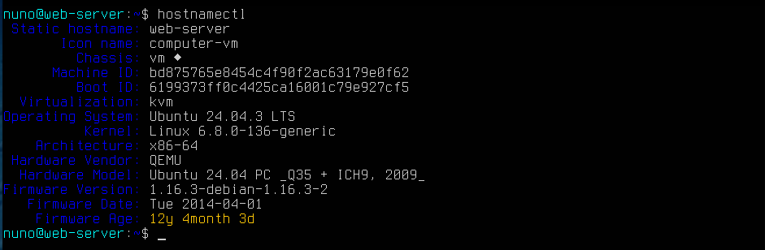

The static hostname provides a persistent identity for the server across reboots.

During installation, the 25 GiB virtual disk `/dev/vda` was manually partitioned using GPT. A 1 MiB BIOS boot partition was created for GRUB, followed by a separate 1 GiB ext4 partition mounted at `/boot`.

The remaining disk space was assigned to an LVM physical volume. LVM was used to create logical volumes for `/`, `/var` and swap. Separating `/var` reduces the risk that uncontrolled growth of logs and other variable data could fill the root filesystem. Approximately 4 GiB were left free in the volume group for future expansion [3].

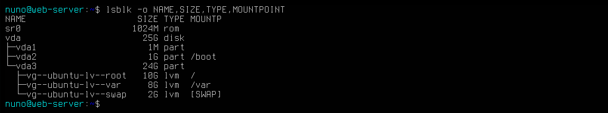 

>For more details:
[Operating System Installation](docs/partitions-configuration.md)


### 3.2 Base System Administration of Web Server

Before installing network and web services, I prepared the base Linux system. This phase covered package maintenance, system identity, time configuration, user roles and access control.

These tasks provide a controlled operating system before installing hte services and other configuration.

**1. Package maintenance**
APT uses the package information from the configured repositories to install and update software. Updating this information before installing the services helps to avoid versioning issues during the installation of the services [3]. The utility used is:

```bash
sudo apt-get update && sudo apt-get upgrade
```


**2. System identity, timezone and locale configuration**

The server hostname, timezone and locale were configured before deploying services. Is important that time is set correctly, to ensure the consistency of logs, SSH sessions and security events that rely of timestamps [4].

The final configuration was validated with timedatectl and locale information.

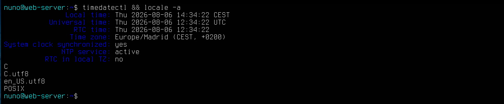


**3. User and group administration**

The server use separate users and groups were created for different responsibilities:

| User | Gropup | Responsibility |
| ---- | ------ | -------------- |
| nuno | admin  | System administration |
| dev | developers | Application development |
| ops | operators | Monitoring |

This design separates responsibilities instead of giving the same permissions to every account.

Linux stores user and group information in /etc/passwd, /etc/shadow and /etc/group. LPIC-1 Objective 107.1 covers the creation, modification and administration of these accounts [4].

The final account configuration was validated with:

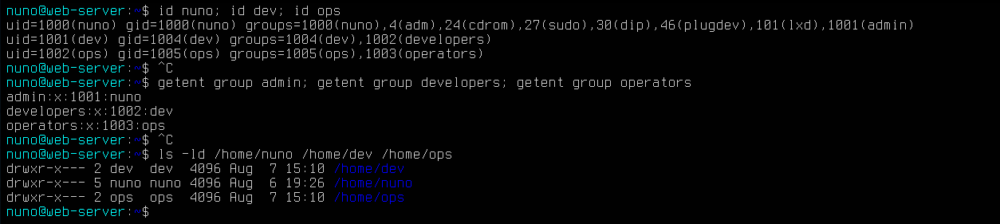

Password ageing and account status were also checked:

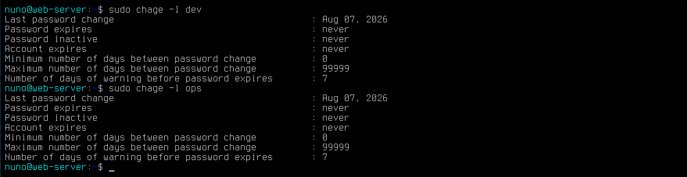

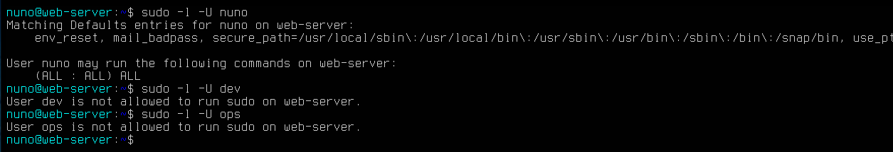


### 3.3 Network Administration

After preparing the base Linux system, the next phase was to configure and validate the network connectivity required by the design defined in Section 2.

This phase focused on interface configuration, static addressing, routing, DNS resolution and connectivity tests [4]. The objective was to ensure that each system could communicate only through the correct network path before applying firewall security policies.


**1. Create the virtual network segments**

The required network segments were created on the KVM/libvirt host before configuring the Web Server.

Three separate virtual networks were defined:

- `web-dmz` for Internet-facing services.
- `management-net` for administration.
- `internal-net` for internal systems.

The networks were configured as persistent and enabled at system startup. This provides the virtual network structure required to separate systems with different security needs [5].

The configuration was verified with:


**2. Persistent network configuration with Netplan**

The Web Server uses Netplan to keep its network configuration persistent after a reboot. A static IP address was assigned to the DMZ interface because a server must have a predictable address for firewall rules, SSH administration and web services [4].

The Web Server was assigned the address `10.0.0.34/28` in the DMZ network `10.0.0.32/28`.

The Web Server uses only its DMZ interface. Its default route points to FW1 at 10.0.0.33, while routes to the Internal and Management networks use FW2 at 10.0.0.46 [4].

The final configuration was checked to confirm the assigned interfaces, addresses and routes.

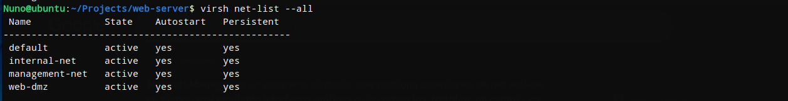

**3. Web Server local firewall**

UFW was configured as the local firewall of the Web Server. The objective is to expose only the services required by the server and block all other incoming traffic [6].

The firewall uses a default-deny policy for incoming connections and allows only:

- `80/tcp` for HTTP.
- `443/tcp` for HTTPS.
- `22/tcp` from the Management Network (`10.0.0.48/29`) for administration.
- `22/tcp` from the authorised developer host (`10.0.0.2`) for application deployment (without implementing).

This reduces the exposed network surface and applies a whitelist model: traffic is blocked unless it is explicitly required [2].

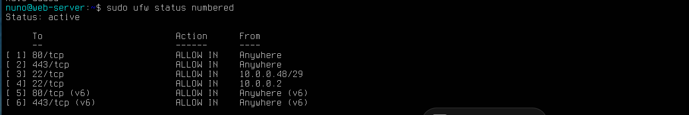

>For more details:
[Network Configuration](docs/configure-network-web-server.md)


### 3.4 Web Services - NGINX

After completing the network configuration, I deployed NGINX as the public web service in the DMZ. The installation and basic server configuration follow *LPIC-2 Objective 208.4: Implementing NGINX as a web server and a reverse proxy*, which covers NGINX configuration, server blocks, document roots and configuration validation [7].

The objective of this phase was to provide a controlled HTTP/HTTPS service, prepare the content permissions and validate the configuration before applying changes.


**1. Configure NGINX service**

Before install Nginx, the next step will be to set the directory permissions of `/var/www/northtech-ops` for deploying the web service code. This directory must remain under root administrative control root, while the group of developers must be able to modify web content. Enabling SGID on the directory allow new files and subdirectories automatically get the 'developers' group. 


In the capture is checked the permissions of configuration directories to confirm that they remain under `root` control. Then, `/var/www/northtech-ops` was assigned to the `developers` group, group access was enabled, and then SGID was applied so new files and directories inherit the `developers` group. The final check confirms the `root:developers` ownership and the SGID permission.


It was created a NGINX server block for *NorthTech Operations* instead of using the default Ubuntu website. The site configuration is stored in `/etc/nginx/sites-available/northtech` and enabled through `/etc/nginx/sites-enabled/` [7], [9].

The configuration separates the global NGINX settings from the application-specific settings and maps the website to `/var/www/northtech-ops`. This makes the service easier to maintain, audit and later extend with HTTPS and reverse-proxy functions [7], [9].

Before applying any configuration change, `nginx -t` is used to validate the configuration. The service is reloaded only after a successful test, reducing the risk of an outage caused by a configuration error [7], [9].

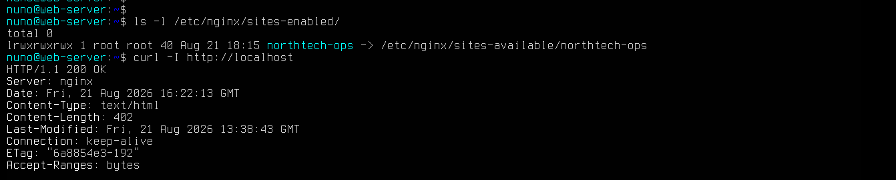

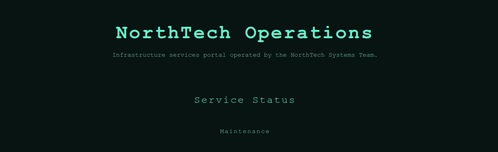

---

**2. HTTP/HTTPS configuration**

The NorthTech Operations website was configured to use HTTPS on TCP port `443`.

HTTP traffic on port `80` is redirected to HTTPS. This ensures that the website is accessed using an encrypted connection.

A self-signed X.509 certificate was created with OpenSSL for the local laboratory environment. The certificate uses `northtech.test` as the server name and is valid for one year.

NGINX was configured to use TLS 1.2 and TLS 1.3. The private key is protected with restricted file permissions [10].

The implementation was validated with `curl` and OpenSSL. The tests confirm:

- HTTP requests are redirected to HTTPS.
- HTTPS returns `HTTP/1.1 200 OK`.
- A TLS connection is established correctly.
- NGINX presents the expected NorthTech Operations certificate.
- The certificate validity dates and identity are correct.

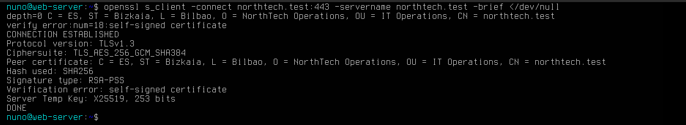


>Detailed implementation: 
[NGINX Service Setup](docs/nginx-service-setup.md)


## 4. DMZ Firewall Infrastructure

After implementing the network segments, I deployed two routed firewalls to control communication between the External, DMZ, Internal and Management networks.

The DMZ firewall design is inspired by the **Cisco ASA model**. Cisco ASA can operate as a stateful firewall in Layer 3 routed mode, where it connects different networks and applies security policies between them. This model also supports an Outside–DMZ–Inside architecture, where public services can be placed in a DMZ without directly exposing internal systems [12].

For this project, I selected Alpine Linux and nftables to apply the same main concepts with a lightweight and auditable Linux solution. FW1 provides perimeter filtering and NAT between the External network and the DMZ, while FW2 protects the Internal and Management networks from the DMZ [2], [7].

---

### 4.1 Firewall FW1

FW1 is the network boundary between the external and the DMZ.

Its two interfaces are:

- `eth0` - external: `192.168.122.2/24`
- `eth1` - DMZ: `10.0.0.33/28`

The default route uses the libvirt gateway `192.168.122.1`. FW1 also has static routes to the Internal (`10.0.0.0/27`) and Management (`10.0.0.48/29`) networks through FW2 at `10.0.0.46` [7].

These routes are required because FW2 is the router connected to both networks. IPv4 forwarding is enabled with `net.ipv4.ip_forward = 1`, allowing FW1 to route packets between its interfaces [7].

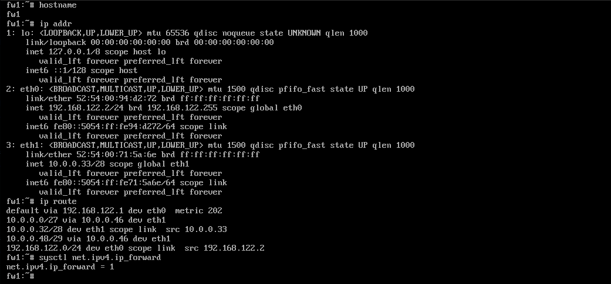

The capture verifies the WAN and DMZ addresses, the default gateway, the routes to the networks behind FW2, and IPv4 forwarding.

---

### 4.2 Firewall FW2

FW2 separates the DMZ from the Internal and Management networks.

Its three interfaces are:

- `eth0` - DMZ: `10.0.0.46/28`
- `eth1` - Internal: `10.0.0.1/27`
- `eth2` - Management: `10.0.0.49/29`

Because FW2 is directly connected to these three networks, Linux creates a route for each network automatically. Its default route points to FW1 at `10.0.0.33`, which is used to reach networks outside these local segments.

IPv4 forwarding is also enabled on FW2 so that it can work as a router between the DMZ, Internal and Management networks.

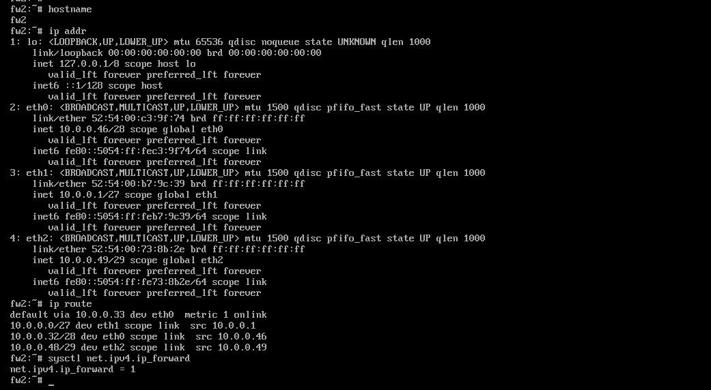

The capture verifies the three network interfaces, the directly connected routes, the default route through FW1 and IPv4 forwarding.

---

### 4.3 Connectivity between FW1 and FW2

After configuring both routers, bidirectional ICMP tests were performed across the DMZ network.

- FW1 (`10.0.0.33`) successfully reached FW2 (`10.0.0.46`).
- FW2 (`10.0.0.46`) successfully reached FW1 (`10.0.0.33`).
- Both tests completed with `0% packet loss`.


This evidence confirms Layer 3 connectivity between both firewall routers over the DMZ. It validates the addressing and basic routing configuration before packet filtering rules are introduced.

These tests do not prove firewall filtering or NAT. Those controls are validated separately after the nftables configuration.

>More details in:
[Firewall Network Configuration](docs/configure-network-fw.md)


### 4.4 Firewall Security Controls

**Stateful Firewall Policy with nftables**

After validating the routing configuration, I applied nftables rules on FW1 and FW2.

A stateful firewall tracks active connections and keeps information such as source address, destination address, protocol and port numbers. This allows the firewall to decide whether a packet belongs to an authorised connection or whether it is trying to start a new one [8].

To implement this behaviour, nftables uses the Linux kernel Connection Tracking system. The operating system keeps a dynamic table in memory with the state of active connections [8].

*Case 1 - The connection is already known*

1. The firewall checks the connection tracking table.
2. If the packet belongs to an authorised existing connection, it is classified as `Established`.
3. The packet is allowed to continue without creating another specific rule for the return direction.

This is the main idea of a stateful firewall: it remembers authorised connections and recognises their valid return traffic [8].

*Case 2 - The connection is new*

1. If the packet does not belong to an existing connection, it is classified as `New`.
2. The firewall checks the security policy for its source, destination and service.
3. If the connection is allowed, the firewall accepts it.
4. From that moment, return packets belonging to the same communication can be recognised as `Established`.
5. If the new connection is not explicitly allowed, it is blocked by the default `DROP` policy.

*Case 3 - The traffic is related to an existing connection*

Some traffic is not part of the original connection but is created because of an authorised connection.

The firewall can classify this traffic as `Related` and allow it because it is linked to an existing valid communication [8].

*Case 4 - The connection state is invalid*

If the firewall cannot associate the packet with a valid connection, it can classify it as `Invalid`.

This traffic is dropped because it does not belong to an authorised or recognised communication [8].


**NAT on FW1**

NAT is configured only on FW1 because it is the firewall connected to the External network.

For incoming HTTPS traffic, FW1 uses DNAT. When a client connects to `192.168.122.2:443`, FW1 changes the destination address and forwards the connection to the Web Server at `10.0.0.34:443`.

For outgoing traffic, FW1 uses SNAT/PAT. Private systems keep their internal addresses inside the infrastructure, but before the traffic leaves through FW1, the source address is changed to `192.168.122.2`.

FW1 therefore performs two translations:

- *DNAT:* External `192.168.122.2:443` → Web Server `10.0.0.34:443`.
- *SNAT/PAT:* private source address → FW1 External address `192.168.122.2`.

FW2 does not use NAT. It only routes and filters traffic between the DMZ, Internal and Management networks [x].


**Firewall Validation and Persistence**

Before applying the rules, the configuration was checked with nft -c. After loading it, nft list ruleset was used to verify the active policies, stateful rules, NAT and packet counters.

The capture confirms the default DROP policy, the active filtering rules and the packet counters. The nftables configuration is also enabled at boot with OpenRC so the firewall rules remain active after a restart.

Detailed firewall rules, deployment steps and ALLOW/DROP tests are documented in:


>More details in:
[Firewall Security Configuration](docs/configure-firewalls.md)


### 5. Remote Administration and Server Hardening

Remote administration of the Web Server is provided through OpenSSH. SSH was selected because it provides encrypted and authenticated remote access to the Linux system [4].

The administration account `nuno` uses public-key authentication. The private key remains on the administrator machine, while only the public key is stored on the Web Server in `~/.ssh/authorized_keys`. LPIC-1 describes public-key authentication as the preferred method for remote SSH access and explains the use of `ssh-keygen`, `ssh-copy-id` for  to generate and copy the public key and `authorized_keys` as the file in which to store it [4].

SSH access has been secured using a specific configuration file:

`/etc/ssh/sshd_config.d/10-web-server-security.conf`

The following controls were applied:

- Direct SSH login as `root` is disabled.
- Public-key authentication is enabled.
- Password authentication is disabled.
- SSH access is limited to the authorised accounts `nuno` and `dev`.

These controls reduce the use of passwords, prevent direct remote access with the root account, and limit which local users can open an SSH session.

The final network design allows the administrator to access SSH only from the Management Network. The developer account will use the their public-key authentication to deploy the web server code.

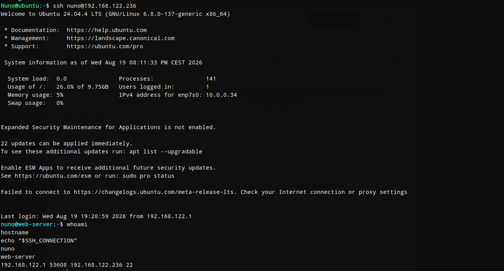

>For more details:
[SSH Configuration](docs/configure-ssh.md)


---


## 6. Operation, Monitoring, Troubleshooting & Controlled Failure Scenarios

This section contains only incidents that actually occurred during the implementation and validation of the server.

| Incident         | Symptoms | Diagnosis | Root cause | Resolution | Evidence |
| ---------------- | -------- | --------- | ---------- | ---------- | -------- |
|  |          |           |            |            |          |


>Detailed troubleshooting records:
[troubleshooting.md](docs/troubleshooting.md)

---


## 7. Quick Start


---


### 8. Future work:


---


## 9. References

[1] Centro Criptológico Nacional, “CCN-STIC-673: Guía de configuración segura en servidores web,” CCN-CERT. [Online]. Available: https://www.ccn-cert.cni.es/es/series-ccn-stic/guias-de-acceso-publico-ccn-stic/6861-ccn-stic-673-guia-de-configuracion-segura-en-servidores-web/file?format=html. [Accessed: Aug. 26, 2026].

[2] K. Scarfone and P. Hoffman, “Guidelines on Firewalls and Firewall Policy,” National Institute of Standards and Technology, NIST Special Publication 800-41 Rev. 1, Sep. 2009. [Online]. Available: https://nvlpubs.nist.gov/nistpubs/Legacy/SP/nistspecialpublication800-41r1.pdf. [Accessed: Aug. 26, 2026].

[3] Linux Professional Institute, “LPIC-1 Learning Materials — Exam 101-500, Version 5.0,” Linux Professional Institute, 2022. See Objectives 102.1, 102.4, 104.1, 104.3 and 104.5.

[4] Linux Professional Institute, “LPIC-1 Learning Materials — Exam 102-500, Version 5.0,” Linux Professional Institute, 2022. See Objectives 107.1, 108.1, 109.2–109.4 and 110.3.

[5] libvirt Project, “Virtual Networking,” libvirt Wiki. [Online]. Available: https://wiki.libvirt.org/VirtualNetworking.html. [Accessed: Aug. 26, 2026].

[6] Canonical Ltd., “UFW — Uncomplicated Firewall,” Ubuntu Community Help Wiki. [Online]. Available: https://help.ubuntu.com/community/UFW. [Accessed: Aug. 26, 2026].

[7] Sue B.V., *The LPIC2 Exam Prep*, 8th ed. β, version 4.5, Geldermalsen, The Netherlands, 2021. [Online]. Available: https://lpic2book.github.io/src/pdf/lpic2book.pdf. [Accessed: Aug. 26, 2026].

[8] Sue B.V., *The LPIC2 Exam Prep*, 8th ed. β, version 4.5, sec. 54.3.7, “Connection tracking: Stateful Firewalling,” p. 382, Geldermalsen, The Netherlands, 2021. [Online]. Available: https://lpic2book.github.io/src/pdf/lpic2book.pdf. [Accessed: Aug. 26, 2026].

[9] Canonical Ltd., “How to configure nginx,” Ubuntu Server Documentation. [Online]. Available: https://ubuntu.com/server/docs/how-to/web-services/configure-nginx/. [Accessed: Aug. 26, 2026].

[10] NGINX, Inc., “Module ngx_http_ssl_module,” NGINX Documentation. [Online]. Available: https://nginx.org/en/docs/http/ngx_http_ssl_module.html#ssl_protocols. [Accessed: Aug. 26, 2026].

[11] OWASP Foundation, “HTTP Security Response Headers Cheat Sheet,” OWASP Cheat Sheet Series. [Online]. Available: https://cheatsheetseries.owasp.org/cheatsheets/HTTP_Headers_Cheat_Sheet.html. [Accessed: Aug. 26, 2026].

[12] Cisco Systems, Inc., “Introduction to the Secure Firewall ASA,” CLI Book 1: Cisco Secure Firewall ASA General Operations CLI Configuration Guide, Release 9.20. [Online]. Available: https://www.cisco.com/c/en/us/td/docs/security/asa/asa920/configuration/general/asa-920-general-config/intro-intro.html. [Accessed: Aug. 26, 2026].


